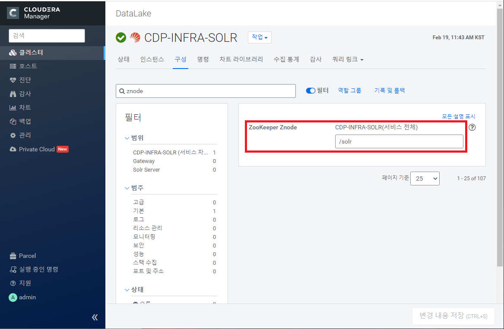

# 서비스 추가

##### 최종 목표


1. [Spark  추가](#Spark)
2. [Hive 추가](#Hive)
3. [Impala 추가](#Impala)
4. [Solr 추가](#Solr)
5. [Ranger 추가](#Ranger)
   - [Trouble shooting](##Trouble shooting)


# Spark

- YARN 필요


##### 클러스터 명 > 작업 > 서비스 추가 > Spark 선택


##### Select Dependencies

YARN이 설치되어 있으면 그냥 넘어감

###### YARN이 없으면 어떻게 뜨는지는 확인 안해봄, 다음에 다시 설치해볼 시간이 있으면 해볼 것


##### 역할 할당 사용자 지정

History Server : hdm2

Gateway : edge


##### 변경 내용 검토

Auto-TLS disabled 시 해당 property들 공백으로 진행


##### 완료 후 구성 재배포 및 재시작


# Hive

- HDFS 필요


##### 클러스터 명 > 작업 > 서비스 추가 > Hive 선택


##### Select Dependencies

YARN, YARN Queue Manager 선택


##### 역할 할당 사용자 지정

Gateway : edge

Hive metastore server : hdm2

Hive server 2 : (Spark이 설치되어 있을시) hdm2


##### DB설정

###### 1_09 CDP_PostgreSQL에서 만든 DB 참고

유형 : PostgreSQL

Use JDBC URL Override : 아니오

호스트 이름 : hdm2.cdp.jh.io

데이터베이스 이름 : metastore

사용자이름 : hive

암호 : hive


##### 변경 내용 검토

수정 사항 없음


##### 완료 후 접속 확인

```bash
beeline -u "jdbc:hive2://hdm2.cdp.jh.io:10000/default;" -n hive -p hive
```


# Impala

- HDFS, Hive 필요


##### 클러스터 명 > 작업 > 서비스 추가 > Impala선택


##### Select Dependencies

HDFS, Hive 있을 시 그냥 넘어감


##### 역할 할당 사용자 지정

State Store : hdm2

Catalog Server : hdm2

Daemon : hdw[1-4]


##### 변경 내용 검토

수정할 것 없음


##### 완료 후  시작


Impala-shell 연결

```
impala-shell -i hdw1.cdp.jh.io -d default
```


-- 작성 중 --

# Solr

- HDFS, KooKeeper 필요

  

##### 클러스터 명 > 작업 > 서비스 추가 > Solr 선택


##### Select Dependencies

HDFS, KooKeeper 설치 되어있으면 그냥 지나감


##### 역할 할당 사용자 지정

Solr Server: hdm1


##### 변경 내용 검토

수정할 내용 없음


##### 완료 후  시작


# Ranger

- HDFS, Solr 반드시 필요(없을 시 진행 안됨

  

##### 클러스터 명 > 작업 > 서비스 추가 > Ranger선택


##### Select Dependencies

그냥 넘어감


##### 역할 할당 사용자 지정

Ranger Admin: hdm1 ( 복수 선택 가능하므로 잘 확인 할 것 )

Ranger Usersync: hdm1

Ranger Tagsync: hdm1


##### 데이터베이스 설정

###### 1_09 CDP_PostgreSQL에서 만든 DB 참고

유형 : PostgreSQL

호스트이름 : adm1.cdp.jh.io

데이터베이스 이름 : ranger

사용자 이름 : rangeradmin

암호 : rangeradmin


##### 변경 내용 검토

angeradmin_user_password: rangeradmin1

rangerusersync_user_password: rangerusersync1

rangertagsync_user_password: rangertagsync1

keyadmin_user_password: keyadmin1


##### 완료 후 시작

http://hdm1.cdp.jh.io:6080/ 접속

###### 초기 설정

username : admin

password : rangeradmin1


### Trouble shooting

Solr 서비스 설치 후 Ranger 설치 시 Solr 서비스명이 CDP-INFRA-SOLR로 자동 변경되고

이후부터 Solr 서비스가 실행되지 않는 문제가 발생


##### 해결방안

CDP-INFRA-SOLR 서비스 > 구성 > ZooKeeper Znode  

Ranger 설치 과정에서 `/solr-infra`로 바뀐 Property를 다시 `/solr` 로 변경해주면 해결 됨

