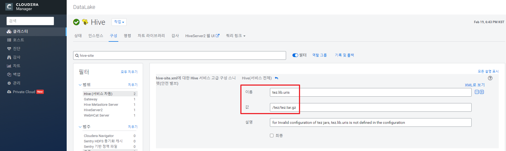

# HIVE CLI

HDFS의 파일을 HIVE를 통해 저장 및 조회하는 것을 목표로 함


#### 로컬 파일 > HDFS로 이동

`hdfs dfs -put <filesrc> <dirsrc>` 

##### 로컬에 있는 chat.log들을 hdfs의 /hive/chat으로 복사


#### HIVE CLI 실행

`beeline -u "jdbc:hive2://hdm2.cdp.jh.io:10000/default" -n hive -p hive`


#### 파일로 Table 생성

- Hive의 Table 종류

  - managed : 그냥 create시 적용되는 default값, 디렉토리에 데이터를 저장하므로 Drop table시 데이터를 보존할 수 없음

  - External : 경로의 데이터를 기반으로 테이블을 만드므로 파일과 스키마를 따로 관리 가능, Drop table을 해도 데이터는 보존됨

    

##### hive/chat 경로의 파일들로 Table 생성 ( 경로는 무조건 디렉토리로 줘야 함 )

`tab`으로 구분된 chat.log 파일을 읽어들여 저장

```bash
# managed table 
create table user_table(id string, chat int) row format delimited fields terminated by '\t' stored as textfile location '/hive/chat';

# external table
create external table user_table_ex(id string, chat int) row format delimited fields terminated by '\t' stored as textfile location '/hive/chat';
```


#### Table 조회

데이터양이 많기 때문에 반드시 limit을 사용해서 조회할 것 

```sql
select * from user_table_ex limit 10;

select count(*) from user_table_ex;
```


### Trouble Shooting

#### 1. 쿼리문 실행시 아래와 같은 오류 발생

##### `Invalid configuration of tez jars, tez.lib.uris is not defined in the configuration`


##### 원인

tez.lib.uris 설정이 없어서였음


##### 해결

```
ssh adm1
hdfs dfs -mkdir /tez
hdfs dfs -put /opt/cloudera/parcels/CDH/lib/tez/tez.tar.gz /tez
```

permission denied시 명령어 앞에 `HADOOP_USER_NAME=hdfs` 직접 명시 (좋은 방법 아님)


##### Cloudera Manager에서 hive Property 수정




##### 서비스 재시작 후 Hive CLI 재실행


#### 2. 쿼리문 실행시 아래와 같은 오류 발생

##### `ROOT_INPUT_INIT_FAILURE, Vertex Input: <TABLE_NAME> initializer failed, vertex=<VERTEX_ID> [Map 1], java.lang.ArithmeticException: / by zero` 


##### 원인

```
0: jdbc:hive2://hdm2.cdp.jh.io:10000/default> SET hive.tez.container.size;
+-----------------------------+
|             set             |
+-----------------------------+
| hive.tez.container.size=-1  |
+-----------------------------+
1 row selected (0.103 seconds)
```


##### 해결

컨터이너 사이즈를 늘려준 후 쿼리문 재실행

```
SET hive.tez.container.size=100;
```

