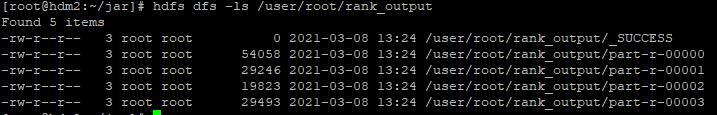

# MapReduce

데이터 처리 솔루션 중 하나, Hadoop 뿐만 아닌 일반 DB에도 존재하는 개념


Map + Reduce 두 단계로 데이터를 처리

- Map : 특정 데이터를 가져와 <Key, Value>쌍으로 묶음
- Reduce : Map에서 묶은 <Key, Value>쌍을 이용하여 내가 필요한 정보로 다시 <Key, Value>쌍으로 묶음


## MR Class 구성 및 작동 순서

1. Mapper : 데이터를 <k,v>쌍으로 묶음
2. Combiner : <k,v>데이터를 key별로 묶어 Reducer로 전송, mini - reducer 라고도 함
3. Partitioner : key-value 페어를 일련의 로직으로 분배, Default = key의 HashCode
4. Reducer : 같은 Key로 모인 데이터를 일련의 로직으로 줄이는 작업, key는 정렬되어있으며 default 정렬 알고리즘은 quick sort임
5. Driver : 위의 작업들로 Job을 설정, Resource Manager로 Job을 제출함


목적에 맞게 작업들은 유동적으로 구성할 수 있음

>mapper -> driver
>
>mapper -> reducer -> driver
>
>mapper -> combiner -> driver
>
>mapper -> combiner -> reducer -> driver
>
>mapper -> combiner -> partitioner -> reducer -> driver


## WordCount

맵리듀스의 가장 기본 예제, C의 hello world와 같은 내용


#### WordCountMapper

FIle을 한줄씩 읽어와 Delimiter로 분할, 분할된 word를 <key,1>로 묶어 주는 역할을 함

상속받는 Mapper< ... >와 map( ... )의 I/O key,value 들은 형을 일치 시켜줘야함

```java
package jh.hadoop.mapreduce.sample;

import org.apache.hadoop.conf.Configuration;
import org.apache.hadoop.io.IntWritable;
import org.apache.hadoop.io.LongWritable;
import org.apache.hadoop.io.Text;
import org.apache.hadoop.mapreduce.Mapper;

import java.io.IOException;

public class WordCountMapper extends Mapper<LongWritable, Text, Text, IntWritable> {

    private String delimiter;

    @Override
    protected void setup(Context context) throws IOException, InterruptedException {
        Configuration configuration = context.getConfiguration();
        delimiter = configuration.get("delimiter", ",");
    }

    @Override
    protected void map(LongWritable key, Text value, Context context) throws IOException, InterruptedException {
        String row = value.toString();
        String[] columns = row.split(delimiter);
        for (String word : columns) {
            context.write(new Text(word), new IntWritable(1));
        }
    }

    @Override
    protected void cleanup(Context context) throws IOException, InterruptedException {
    }
}
```


### WordCountReducer

Mapper에서 보낸 output key, value가 reducer의 input key,value가 됨

이때 input values는 key별로 묶인 value들의 배열로 입력받음

```
package jh.hadoop.mapreduce.sample;

import org.apache.hadoop.io.IntWritable;
import org.apache.hadoop.io.Text;
import org.apache.hadoop.mapreduce.Reducer;

import java.io.IOException;
import java.util.Iterator;

public class WordCountReducer extends Reducer<Text, IntWritable, Text, IntWritable> {

    @Override
    protected void setup(Context context) throws IOException, InterruptedException {
    }

    @Override
    protected void reduce(Text key, Iterable<IntWritable> values, Context context) throws IOException, InterruptedException {
        Iterator<IntWritable> iterator = values.iterator();
        int sum = 0;
        while (iterator.hasNext()) {
            IntWritable one = iterator.next();
            sum += one.get();
        }
        context.write(key, new IntWritable(sum));
    }

    @Override
    protected void cleanup(Context context) throws IOException, InterruptedException {
    }
}
```


### WordCountDriver

```java
package jh.hadoop.mapreduce.sample;

import org.apache.hadoop.fs.Path;
import org.apache.hadoop.io.IntWritable;
import org.apache.hadoop.io.Text;
import org.apache.hadoop.mapreduce.Job;
import org.apache.hadoop.mapreduce.lib.input.FileInputFormat;
import org.apache.hadoop.mapreduce.lib.output.FileOutputFormat;
import org.apache.hadoop.util.GenericOptionsParser;
import org.apache.hadoop.util.ToolRunner;

import java.io.IOException;

public class WordCountDriver extends org.apache.hadoop.conf.Configured implements org.apache.hadoop.util.Tool {

    public static void main(String[] args) throws Exception {
        int res = ToolRunner.run(new WordCountDriver(), args);
        System.exit(res);
    }

    public int run(String[] args) throws Exception {
        GenericOptionsParser parser = new GenericOptionsParser(this.getConf(), args);
        String[] remainingArgs = parser.getRemainingArgs();
        Job job = Job.getInstance(this.getConf());
        parseArguments(remainingArgs, job);

        job.setJarByClass(WordCountDriver.class);

        // Mapper & Reducer Class
        job.setMapperClass(WordCountMapper.class);
        job.setReducerClass(WordCountReducer.class);

        // Mapper Output Key & Value Type after Hadoop 0.20
        job.setMapOutputKeyClass(Text.class);
        job.setMapOutputValueClass(IntWritable.class);

        // Reducer Output Key & Value Type
        job.setOutputKeyClass(Text.class);
        job.setOutputValueClass(IntWritable.class);

        // Run a Hadoop Job
        return job.waitForCompletion(true) ? 0 : 1;
    }

    private void parseArguments(String[] args, Job job) throws IOException {
        for (int i = 0; i < args.length; ++i) {
            if ("-input".equals(args[i])) {
                FileInputFormat.addInputPaths(job, args[++i]);
            } else if ("-output".equals(args[i])) {
                FileOutputFormat.setOutputPath(job, new Path(args[++i]));
            } else if ("-delimiter".equals(args[i])) {
                job.getConfiguration().set("delimiter", args[++i]);
            } else if ("-reducer".equals(args[i])) {
                job.setNumReduceTasks(Integer.parseInt(args[++i]));
            }
        }
    }
}
```


### JAR 생성 및 실행

1. Intellij의 Maven 탭 > Lifecycle > (clean) > package

2. terminal > `scp < target/~.jar 파일 path> root@hdm2.cdp.jh.io:~/Downloads`

3. `cd ~/Downloads` > `yarn jar jh.hadoop.mapreduce.sample.WordCountDriver -input /user/root/chat -output /user/root/chat/chat_output -delimiter "\t" -reducer 4`

   > yarn jar `드라이버class의 Reference`  -input `입력할 데이터가 위치한 디렉토리` -output `결과 저장하기 위해 생성할 디렉토리` -delimiter `입력 데이터 구분자` -reducer `생성할 reduce 수`

4. 실행 과정은 http://hdm2.cdp.jh.io:8088/cluster 경로를 통해 확인가능

5. 실행 과정에서 오류 발생시 yarn app -kill `<application ID>`를 통해 Job을 강제 종료할 수 있음

기본적으로 파일 1개당 1개의 map이 생성되나, 파일 size가 block size를 넘을 경우 맵을 추가로 생성한다.


#### 바로 Install 할 경우

pom.xml에 아래의 Plugin 추가

```xml
<plugin>
                <artifactId>maven-antrun-plugin</artifactId>
                <executions>
                    <execution>
                        <id>scp</id>
                        <phase>install</phase>
                        <goals>
                            <goal>run</goal>
                        </goals>
                        <configuration>
                            <tasks>
                                <scp todir="root:password@IP Addr:~/Downloads" trust="true" failonerror="false">
                                    <fileset dir="${basedir}/target">
                                        <include name="${project.build.finalName}*.jar"/>
                                    </fileset>
                                </scp>
                                <sshexec host="IP Addr" username="root" trust="true" failonerror="false" password="password"
                                         command="mv ~/Downloads/mapreduce-template-1.0.0-SNAPSHOT.jar ~/Downloads/mr.jar">
                                </sshexec>
                            </tasks>
                        </configuration>
                    </execution>
                </executions>
                <dependencies>
                    <dependency>
                        <groupId>ant</groupId>
                        <artifactId>ant-jsch</artifactId>
                        <version>1.6.5</version>
                    </dependency>
                    <dependency>
                        <groupId>com.jcraft</groupId>
                        <artifactId>jsch</artifactId>
                        <version>0.1.42</version>
                    </dependency>
                </dependencies>
            </plugin>
```

Intellij의 Maven 탭 > Lifecycle > (clean) > install 수행 후 ~/Downloads 경로에 mr.jar 파일로 자동 변경 됨


#### Input data가 gzip일 경우

gzip은 파일 size가 block size를 넘어도 맵은 하나만 생긴다.

이는 gzip이 DEFLATE 알고리즘을 사용하여 gzip 스트림이 각 block split이 특정 위치에서 읽기를 지원하지 않으므로 mapreduce 과정에서 각 block별로 split을 생성할 수 없기 때문임


압축포맷별 split 가능 여부

| 압축포맷 | 도구  | 알고리즘 | 파일 확장명 | 분할 가능 |
| -------- | ----- | -------- | ----------- | --------- |
| DEFLATE  | N/A   | DEFLATE  | .deflate    | No        |
| gzip     | gzip  | DEFLATE  | .gz         | No        |
| bzip2    | bzip2 | bzip2    | .bz2        | Yes       |
| LZO      | lzop  | LZO      | .lz0        | No        |
| LZ4      | N/A   | LZ4      | .lz4        | No        |
| Snappy   | N/A   | Snappy   | .snappy     | No        |


### 결과 확인

##### hdfs dfs -ls `<output path>`를 통해 출력 파일 확인 가능



##### hdfs dfs -cat `<output file path>`|head 를 통해 내용 확인가능

###### 내용이 많으므로 반드시 `head` 또는 `tail` 명령어와 함께 사용할 것


mapreduce를 다시 수행하기 위해서는 이전의 output 파일이 없어야 함

##### hdfs dfs -rm -r (-skipTrash) `<output path>` 로 삭제

> -rm 수행시 파일은 삭제되는 것이 아니라 쓰레기통으로 이동하게 됨
>
> -skipTrash를 하게되면 쓰레기통으로 보내지 않고 바로 삭제되며 복구 할 수 없음.


## TeraGen

성능 확인을 위한 더미 데이터 생성

- yarn jar hadoop-mapreduce-examples-3.1.1.3.0.1.0-187.jar -Dmapreduce.job.maps=<DATANODES> teragen 100000000 /download/teragen


## TeraSort

TeraGen 데이터를 정렬하여 성능 확인

- yarn jar `hadoop-mapreduce-examples-3.1.1.3.0.1.0-187.jar` terasort `-Dmapreduce.map.memory.mb=1024` `-Dmapreduce.reduce.memory.mb=1024` `-Dmapreduce.terasort.num-rows=100000000` `-Dmapreduce.terasort.num.partitions=4 /tmp/teragen /tmp/terasort`


## TestDFSIO

HDFS I/O 성능 체크

1. 가용 메모리 확인 및 설정

   - 어플리케이션 메모리 

     yarn -> am -> application memory

   - 컨테이너 메모리

     yarn.nodemanager.resource.memory-mb 

   - 가용 가능한 메모리 

     nodemanager memory - application memory 

   - 최대 컨테이너 메모리 (mareduce에서 사용할 메모리)

     yarn.scheduler.maximum-allocation-mb

     

     ex> datanode가 4개이고 nodemanager가 서버당 가용메모리를 2g로 할당하면 ,총 가용가능한 메모리 = 8g,
     여기서 application메모리로 1g를 사용하면, 테스트에 사용할 수 있는 총 메모리는 7g가 됨

     테스트할 datanode disk 갯수가 4이고 size가 1g이면 테스트에는 총 4g만 사용하게되므로 남은 3g에 대한 테스트는 이루어지지않는 것과 같은 결과가 됨
     그러므로 TestDFSIO를 할때는 사용가능메모리, 테스트할메모리 들을 잘 계산하여 사용할 필요가 있음

     

2. Write 생성

   - HADOOP_USER_NAME=hdfs hdfs dfs -mkdir -p /benchmarks/TestDFSIO

   - HADOOP_USER_NAME=hdfs hdfs dfs -chown -R ${USER}:hdfs /benchmarks

   - yarn jar hadoop-mapreduce-client-jobclient-3.1.1.7.1.4.0-203-tests.jar TestDFSIO -Dmapreduce.map.memory.mb=1536 -Dmapreduce.reduce.memory.mb=1536 -write -nrFiles 4 -size 384MB

     ```
     yarn jar hadoop-mapreduce-client-jobclient-3.1.1.3.0.1.0-187-tests.jar TestDFSIO -Dmapreduce.map.memory.mb=<(yarn.nodemanager.resource.memory-mb - yarn.app.mapreduce.am.resource.mb) / node 별 disk 개수> -Dmapreduce.reduce.memory.mb=<(yarn.nodemanager.resource.memory-mb - yarn.app.mapreduce.am.resource.mb) / node 별 disk 개수> -write -nrFiles <DATANODES * disks> -size <BLOCKSIZE * n>MB
     ```

     

3. Read 수행

   - read를 위해선 write가 선행되어야함

   - yarn jar hadoop-mapreduce-client-jobclient-3.1.1.7.1.4.0-203-tests.jar TestDFSIO -read -nrFiles 4 -size 384MB

     ```
     yarn jar hadoop-mapreduce-client-jobclient-3.1.1.3.0.1.0-187-tests.jar TestDFSIO -read -nrFiles <DATANODES * disks> -size <BLOCKSIZE * n>MB
     ```

     

4. 결과 확인

   ```
   21/03/03 15:25:16 INFO fs.TestDFSIO: ----- TestDFSIO ----- : write
   21/03/03 15:25:16 INFO fs.TestDFSIO:             Date & time: Wed Mar 03 15:25:16 KST 2021
   21/03/03 15:25:16 INFO fs.TestDFSIO:         Number of files: 4
   21/03/03 15:25:16 INFO fs.TestDFSIO:  Total MBytes processed: 1536
   21/03/03 15:25:16 INFO fs.TestDFSIO:       Throughput mb/sec: 60.85
   21/03/03 15:25:16 INFO fs.TestDFSIO:  Average IO rate mb/sec: 73.79
   21/03/03 15:25:16 INFO fs.TestDFSIO:   IO rate std deviation: 38.74
   21/03/03 15:25:16 INFO fs.TestDFSIO:      Test exec time sec: 43.23
   
   21/03/03 15:26:12 INFO fs.TestDFSIO: ----- TestDFSIO ----- : read
   21/03/03 15:26:12 INFO fs.TestDFSIO:             Date & time: Wed Mar 03 15:26:12 KST 2021
   21/03/03 15:26:12 INFO fs.TestDFSIO:         Number of files: 4
   21/03/03 15:26:12 INFO fs.TestDFSIO:  Total MBytes processed: 1536
   21/03/03 15:26:12 INFO fs.TestDFSIO:       Throughput mb/sec: 1590.06
   21/03/03 15:26:12 INFO fs.TestDFSIO:  Average IO rate mb/sec: 1720.92
   21/03/03 15:26:12 INFO fs.TestDFSIO:   IO rate std deviation: 406.85
   21/03/03 15:26:12 INFO fs.TestDFSIO:      Test exec time sec: 19.25
   ```

   

   블록사이즈를 다르게 줘도 읽으나 성능이 많이 저하됨

   ```
   21/03/03 15:28:11 INFO fs.TestDFSIO: ----- TestDFSIO ----- : read
   21/03/03 15:28:11 INFO fs.TestDFSIO:             Date & time: Wed Mar 03 15:28:11 KST 2021
   21/03/03 15:28:11 INFO fs.TestDFSIO:         Number of files: 4
   21/03/03 15:28:11 INFO fs.TestDFSIO:  Total MBytes processed: 1024
   21/03/03 15:28:11 INFO fs.TestDFSIO:       Throughput mb/sec: 714.09
   21/03/03 15:28:11 INFO fs.TestDFSIO:  Average IO rate mb/sec: 893.1
   21/03/03 15:28:11 INFO fs.TestDFSIO:   IO rate std deviation: 480.42
   
   21/03/03 15:28:11 INFO fs.TestDFSIO:      Test exec time sec: 20.89
   ```

   또한 파일 개수를 다르게 주면 Fail 됨