# Spark CLI/API

## Spark로 csv 파일 읽기


#### Local에 저장 후 hdfs에 저장

```
hdsf dfs -mkdir /user/root/flightdata

cd ~/filghtdata

hdfs dfs -put * /user/root/flightdata

hdfs dfs -ls /user/root/flightdata
```


### 1.Spark-shell 에서 CSV 읽기


#### spark-shell 실행

```
spark-shell
```


#### CSV File 읽기

> Scala에서는 따로 옵션을 주지않으면 Default로 DataFrame 형태로 저장함

```
val flightdata = spark.read.option("inferSchema", true).option("header",true).csv("/user/root/flightdata/*")
```


- ##### inferSchema 옵션을 사용하지않고 직접 Schema를 명시해주면 Read 속도가 향상됨

  ```
  import org.apache.spark.sql.types._
   
  val customSchema = StructType(Array(StructField("DEST_COUNTRY_NAME",StringType,true),
     StructField("ORIGIN_COUNTRY_NAME",StringType,true),
     StructField("count",IntegerType,true)))
   
  val flightdata = spark.read.format("csv").option("header", true).schema(customSchema).load("/user/root/flightdata/*")
  ```

  

#### 결과 출력

```
flightdata.show(10)
```

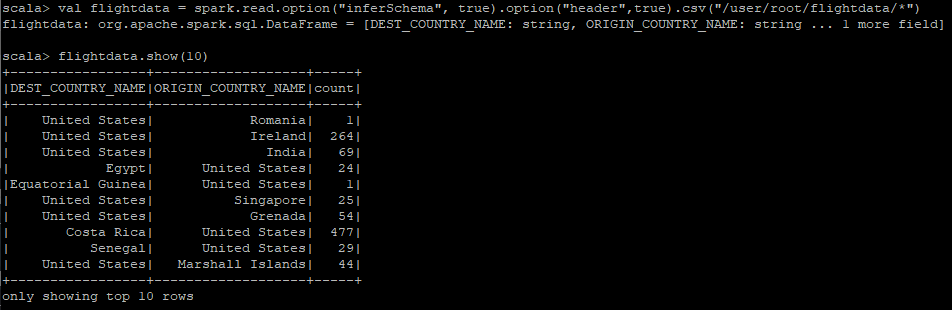


- ##### Delimiter가 Comma가 아닌 파일 읽기

  delimiter 옵션만 추가해주면 됨

  ```
  val flightdata = spark.read
  	.option("inferSchema",true)
  	.option("header",true)
  	.option("delimiter","\t")
  	.csv("hdfs:///user/root/flightdata/*")
  ```

  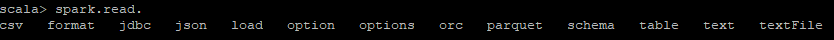
  
  CSV파일 외에도 위의 Format의 파일은 모두 읽을 수 있으며, format을 이용하여 직접 만들 수도 있음
  
  

### 2. jar 파일로 실행


#### Intellij > Maven Project 생성


#### pom.xml 수정

> Hadoop API는 Spark API 에 포함되어 다운되는 것으로 보임
>
> 혹시나 안된다면 Hadoop API도 추가해 볼 것

```
<?xml version="1.0" encoding="UTF-8"?>
<project xmlns="http://maven.apache.org/POM/4.0.0"
         xmlns:xsi="http://www.w3.org/2001/XMLSchema-instance"
         xsi:schemaLocation="http://maven.apache.org/POM/4.0.0 http://maven.apache.org/xsd/maven-4.0.0.xsd">
    <modelVersion>4.0.0</modelVersion>

    <groupId>org.example</groupId>
    <artifactId>SparkByJava</artifactId>
    <version>1.0-SNAPSHOT</version>
  
    <dependencies>

        <!-- ============= -->
        <!--  Spark API  -->
        <!-- ============= -->

        <dependency>
            <groupId>org.apache.spark</groupId>
            <artifactId>spark-core_2.11</artifactId>
            <version>2.4.0.7.1.4.0-203</version>
        </dependency>

        <dependency>
            <groupId>org.apache.spark</groupId>
            <artifactId>spark-sql_2.11</artifactId>
            <version>2.4.0.7.1.4.0-203</version>
        </dependency>
        
        <!-- ============= -->
        <!--  Hadoop API  -->
        <!-- ============= -->

        <dependency>
            <groupId>org.apache.hadoop</groupId>
            <artifactId>hadoop-common</artifactId>
            <version>3.1.1.7.1.4.0-203</version>
        </dependency>

        <dependency>
            <groupId>org.apache.hadoop</groupId>
            <artifactId>hadoop-hdfs</artifactId>
            <version>3.1.1.7.1.4.0-203</version>
        </dependency>

        <dependency>
            <groupId>org.apache.hadoop</groupId>
            <artifactId>hadoop-mapreduce-client-jobclient</artifactId>
            <version>3.1.1.7.1.4.0-203</version>
        </dependency>

    </dependencies>

    <properties>
        <maven.compiler.source>8</maven.compiler.source>
        <maven.compiler.target>8</maven.compiler.target>
    </properties>

    <repositories>
        <repository>
            <id>cloudera-public</id>
            <url>https://repository.cloudera.com/artifactory/public/</url>
        </repository>
    </repositories>

</project>
```


- ##### jar파일을 빌드하면서 옮기는 방법

아래의 코드를 자신의 환경에 맞게 수정하여 pom.xml에 추가

```
	<build>
        <plugins>
            <plugin>
                <artifactId>maven-antrun-plugin</artifactId>
                <executions>
                    <execution>
                        <id>scp</id>
                        <phase>install</phase>
                        <goals>
                            <goal>run</goal>
                        </goals>
                        <configuration>
                            <tasks>
                                <scp todir="root:비밀번호@Spark실행할 네임노드IP:~/jar/spark" trust="true" failonerror="false">
                                    <fileset dir="${basedir}/target">
                                        <include name="${project.build.finalName}*.jar"/>
                                    </fileset>
                                </scp>
                                <sshexec host="Spark실행할 네임노드IP" username="root" trust="true" failonerror="false" password="비밀번호"
                                         command="mv ~/jar/spark/SparkByJava-1.0-SNAPSHOT.jar ~/jar/spark/sbj.jar">
                                </sshexec>
                            </tasks>
                        </configuration>
                    </execution>
                </executions>
                <dependencies>
                    <dependency>
                        <groupId>ant</groupId>
                        <artifactId>ant-jsch</artifactId>
                        <version>1.6.5</version>
                    </dependency>
                    <dependency>
                        <groupId>com.jcraft</groupId>
                        <artifactId>jsch</artifactId>
                        <version>0.1.42</version>
                    </dependency>
                </dependencies>
            </plugin>
        </plugins>
    </build>
```


#### resources에 core-site.xml 추가

HDFS HA가 설정되어 있으므로 아래와 같이 core-site.xml을 추가해주었음

```
<configuration>
    <property>
        <name>fs.defaultFS</name>
        <value>hdfs://nn</value>
    </property>
    <property>
        <name>dfs.nameservices</name>
        <value>nn</value>
    </property>
    <!-- my nn -->
    <property>
        <name>dfs.ha.namenodes.nn</name>
        <value>nn1,nn2</value>
    </property>
    <property>
        <name>dfs.namenode.rpc-address.nn.nn1</name>
        <value>hdfs://hdm1.cdp.jh.io:8020</value>
    </property>
    <property>
        <name>dfs.namenode.rpc-address.nn.nn2</name>
        <value>hdfs://hdm2.cdp.jh.io:8020</value>
    </property>
    <property>
        <name>dfs.client.failover.proxy.provider.nn</name>
        <value>org.apache.hadoop.hdfs.server.namenode.ha.ConfiguredFailoverProxyProvider</value>
    </property>
</configuration>
```


#### CSV File을 DataFrame 형태로 읽은 뒤 출력 및 저장

저장 시 따로 format을 주지않으면 Default인 Parquet파일로 저장됨

```
import org.apache.spark.sql.DataFrameWriter;
import org.apache.spark.sql.Dataset;
import org.apache.spark.sql.Row;
import org.apache.spark.sql.SparkSession;

public class ReadCSV {

    public static void main(String[] args) throws Exception {

        if (args.length < 1) {
            System.err.println("Usage : ReadCSV <input file path>");
            System.exit(1);
        }

        SparkSession spark = SparkSession.builder()
                .appName("Java Spark Read CSV")
                .master("yarn")
                .getOrCreate();

        CSVtoDataFrame(spark, args);
    }

    private static void CSVtoDataFrame(SparkSession spark, String[] args) throws Exception {

        Dataset<Row> df = spark.read()
                .option("header", "true")
                .option("inferSchema", "true")
                .csv(args[0]);

        df.show();
        df.printSchema();
        DataFrameWriter<Row> write = df.write();
        write.save("spark_output");
    }
}
```

SparkSession 객체에는 `.config("key","value")`를 이용하여 설정들을 추가할 수 있음


자세한 Spark Configuration Option은 아래의 공식문서를 참조

https://spark.apache.org/docs/latest/configuration.html


#### Jar파일 생성 및 실행

위에서 maven-antrun-plugin을 설정하였으면 Maven > install 하면 설정한 경로에 Jar파일이 생성됨

설정하지 않았다면 Maven > pakage 후 target 디렉토리에 생성된 jar파일을 Spark가 실행될 서버에 저장


jar파일이 있는 디렉토리로 이동 후 spark-submit으로 jar파일 실행

```
cd ~/jar/spark
spark-submit --class ReadCSV sbj.jar /user/root/flightdata/*
```


show(), printschema() 결과

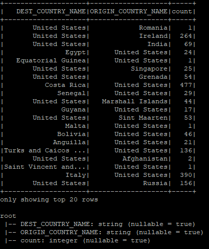


write().save() 결과

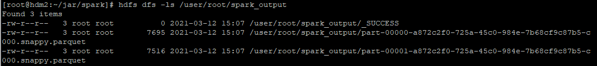


------

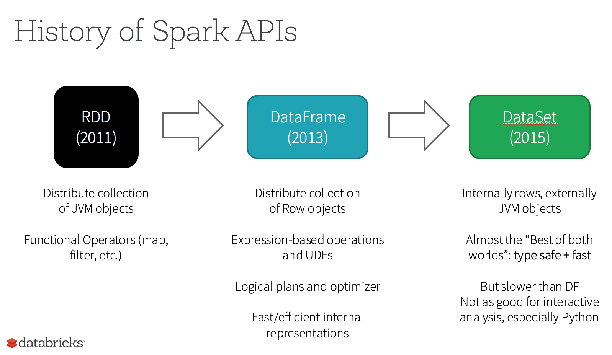


## RDD

RDD (Resilient Distributed Dataset) 

Spark에서 사용되는 가장 기본적인 데이터 객체

Spark Core에서는 RDD는 변경할 수 없는(Immutable) 데이터의 집합으로 클러스터 내의 여러 노드에 분산되어 있음


#### RDD를 제어하는 연산 종류

1. Transformation : 외부 데이터 또는 RDD에서 연산 후 새로운 RDD를 생성하는 작업
2. Action : 궁극적으로 원하는 결과물(연산 결과가 RDD가 아닌 다른 타입인 경우)이 출력되는 작업


#### Lazy-Evalution (지연처리)

Transformation 연산을 수행해도 실제로 데이터는 처리되지 않고 계산을 위한 수행 계획(RDD)이 생성됨

실제 계산은 Action 연산을 호출하는 시점에서 수행되어 작업의 효율성을 높임

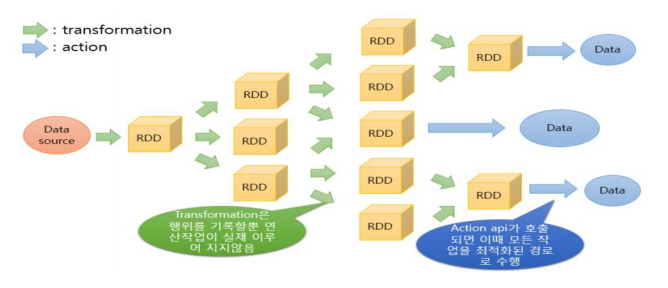

> RDD는 Action이 호출될 때마다 새로운 연산을 처리함
>
> 이때, persist() 메소드를 사용하면 처리 결과를 유지, 재사용할 수 있음


#### RDD를 사용하는 경우

- low-level API인 Transformation, Action을 사용할 때

- 데이터가 미디어와 같이 비구조화 형태로 되어 있을 때

- 데이터를 함수형 프로그래밍으로 조작하고 싶을 때

- 데이터를 처리할 때, 칼럼 형식과 같은 스키마를 굳이 따지고 싶지 않을 때

- 최적화를 굳이 신경쓰지 않을 때


#### RDD 객체 생성

RDD는 SparkContext 객체를 이용하여 생성할 수 있음


- ##### Spark-shell 에서 생성

  ###### spark-shell 실행

  ```
  spark-shell
  ```

  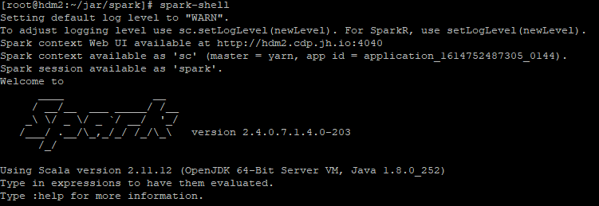

  `sc`(SparkContext 객체)가 자동으로 초기화되고 이를 이용하여 RDD 생성 가능

  

  설정이 다를 경우 아래와 같이 직접 초기화해줄 수 있음

  ```scala
  import org.apache.spark.SparkContext
  import org.apache.spark.SparkConf
  
  // SparkContext 객체 초기화 
  // 클러스터 매니저의 타입 지정
  val conf = new SparkConf().setAppName("sample").setMaster("yarn")
  val sc = new SparkContext(conf)
  ```

  

  1. ###### 내부데이터 이용(Parallelized Collections)

     parallelize() 메소드를 이용하여 직접 데이터를 입력

     ```scala
     scala> val data = Array(1,2,3,4,5)
     data: Array[Int] = Array(1, 2, 3, 4, 5)
     
     scala> val disData = sc.parallelize(data, 5)
     disData: org.apache.spark.rdd.RDD[Int] = ParallelCollectionRDD[2] at parallelize at <console>:26
     
     scala> disData.filter(_ >= 4).reduce(_ + _)
     res0: Int = 9
     ```

     

  2. ###### 외부데이터 이용

     ```scala
     val flightdata = sc.textFile("/user/root/flightdata/*")
     ```

     

     RDD객체가 생성됨 

     

- ##### jar파일로 RDD객체 생성 후 출력

```
import org.apache.spark.api.java.JavaRDD;
import org.apache.spark.api.java.JavaSparkContext;
import org.apache.spark.sql.Row;
import org.apache.spark.sql.RowFactory;
import org.apache.spark.sql.SparkSession;

import java.lang.reflect.Array;
import java.util.Arrays;
import java.util.List;

public class CreateRDD {

    public static void main(String[] args) throws Exception {

        if (args.length < 1){
            System.err.println("Usage : ReadCSV <input file path>");
            System.exit(1);
        }
        SparkSession spark = SparkSession.builder()
                .appName("Java Spark Read CSV")
                .getOrCreate();

        CSVtoRDD(spark,args);
    }

    private static void CSVtoRDD(SparkSession spark, String[] args) throws Exception {
        JavaSparkContext sc = new JavaSparkContext(spark.sparkContext());
        JavaRDD<String> rdd = sc.textFile(args[0]);

        JavaRDD<String[]> rdd_split = rdd.map(line -> line.split(",",0));
        JavaRDD<Row> rddOfRows = rdd_split.map(RowFactory::create);

        rddOfRows.take(10).forEach(System.out::println);
    }
}
```

```
cd ~/jar/spark
spark-submit --class CreateRDD sbj.jar /user/root/flightdata/*
```

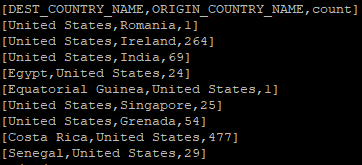


## DataFrame

RDD와 같이 변경 할 수 없는(Immutable) 데이터 집합.

대신,  RDB의 관계형 테이블처럼 칼럼명과 데이터타입을 명시한 Schema를 가지고 있음


Spark SQL 옵티마이저로 데이터를 추출할 수 있고, optimization(최적화)를 할 수 있다.


Spark 2.0에서 Dataframe API는 Datasets API와 통합됨


#### DataFrame을 사용하는 경우

- 높은 추상화의 API를 사용하고 싶을 때
- map, filters 등 다양한 Spark API를 사용하고 싶을 때
- JVM을 지원하지않는 R, Python 사용자일 때


잘 이해가 되지않는다면 Python Pandas의 DataFrame을 참고해볼 것

https://pandas.pydata.org/pandas-docs/stable/reference/api/pandas.DataFrame.html


#### DataFrame 생성

- ##### spark-shell에서 생성

  1. ###### 배열 RDD  -> DataFrame 

     ```scala
     // 위에서 만든 disData RDD 객체 사용
     
     scala> val disDF = disData.toDF()
     disDF: org.apache.spark.sql.DataFrame = [value: int]
     
     scala> disDF.show()
     +-----+
     |value|
     +-----+
     |    1|
     |    2|
     |    3|
     |    4|
     |    5|
     +-----+
     
     // Column명 설정
     scala> val disDF = disData.toDF("Number")
     disDF: org.apache.spark.sql.DataFrame = [Number: int]
     
     scala> disDF.show()
     +------+
     |Number|
     +------+
     |     1|
     |     2|
     |     3|
     |     4|
     |     5|
     +------+
     ```

  

  2. ###### 복합구조 RDD -> DataFrame

     ```scala
     scala> val coffeeRDD = sc.parallelize(
     	Seq(("Americano", 4300),
         ("CafeLatte", 5300),
         ("CafeMocha", 5800))
     )
     
     coffeeRDD: org.apache.spark.rdd.RDD[(String, Int)] = ParallelCollectionRDD[12] at parallelize at <console>:24
     
     scala> val coffeeDF = coffeeRDD.toDF("menu","price")
     
     coffeeDF: org.apache.spark.sql.DataFrame = [menu: string, price: int]
     
     scala> coffeeDF.show()
     +---------+-----+
     |     menu|price|
     +---------+-----+
     |Americano| 4300|
     |CafeLatte| 5300|
     |CafeMocha| 5800|
     +---------+-----+
     
     ```

     

  3. ###### RDD + Schema -> DataFrame

     ```scala
     import org.apache.spark.sql._
     import org.apache.spark.sql.types._
     
     scala> val trainRDD = sc.parallelize(
       Seq(
            Row("Seoul", "Busan", 46000),
            Row("Seoul", "Gwangju", 51000),
            Row("Seoul", "Daegu", 39000)
       )
     )
     
     trainRDD: org.apache.spark.rdd.RDD[org.apache.spark.sql.Row] = ParallelCollectionRDD[3] at parallelize at <console>:30
     
     scala> val trainSchema = new StructType().
     add(StructField("depart",   StringType, true)).
     add(StructField("arrive", StringType, true)).
     add(StructField("price", IntegerType, true))
     
     trainSchema: org.apache.spark.sql.types.StructType = StructType(StructField(depart,StringType,true), StructField(arrive,StringType,true), StructField(price,IntegerType,true))
     
     scala> val trainDF = spark.createDataFrame(trainRDD, trainSchema)
     
     trainDF: org.apache.spark.sql.DataFrame = [depart: string, arrive: string ... 1 more field]
     
     scala> trainDF.show()
     +------+-------+-----+
     |depart| arrive|price|
     +------+-------+-----+
     | Seoul|  Busan|46000|
     | Seoul|Gwangju|51000|
     | Seoul|  Daegu|39000|
     +------+-------+-----+
     
     ```

     

  4. ###### 외부데이터 이용

     [위의 csv 예제](#1.Spark-shell 에서 CSV 읽기) 참고


## Dataset

- Row타입의 Dataset == DataFrame, 즉, Dataset의 집합이 DataFrame

- JVM 기반으로 만들어져 R과 Python에서는 사용할 수 없음

- Spark 1.6에 도입되었으며 2.0에서 DataFrame API와 통합되면서 2가지 특징을 가지게 됨

  - Strongly-typed API	

    | Language |                Main Abstraction                 |
    | :------: | :---------------------------------------------: |
    |  Scala   | Dataset[T] & DataFrame (alias for Dataset[Row]) |
    |   Java   |                   Dataset[T]                    |
    |  Python  |                    DataFrame                    |
    |    R     |                    DataFrame                    |

    

  - Untyped API

    Schema의 Tpye이 정의되지 않고 Generic 타입으로 데이터 구조가 형성됨

    Spark에서는 아래와 같이 표현함

    ```
    DataFrame = Dataset[Row] 
    `Row` : generic untyped JVM objects.
    ```


#### Dataset을 사용하는 경우

- 높은 추상화의 API를 사용하고 싶을 때

- map, filters 등 다양한 Spark API를 사용하고 싶을 때

- 컴파일 단계에서 더 높은 수준의 type-safety를 확보하고 싶을 때

  

  - Type-Safety

    사용자로 하여금 사용하는 데이터 값의 타입을 명확히 하도록 함 = 타입의 안정성 보장

    데이터의 타입을 Check할 수 있어 Runtime시가 아닌 컴파일시에 에러를 찾을 수 있음


    아래는 SQL, DF, DS에서 오류를 감지하는 단계를 나타낸 그림

  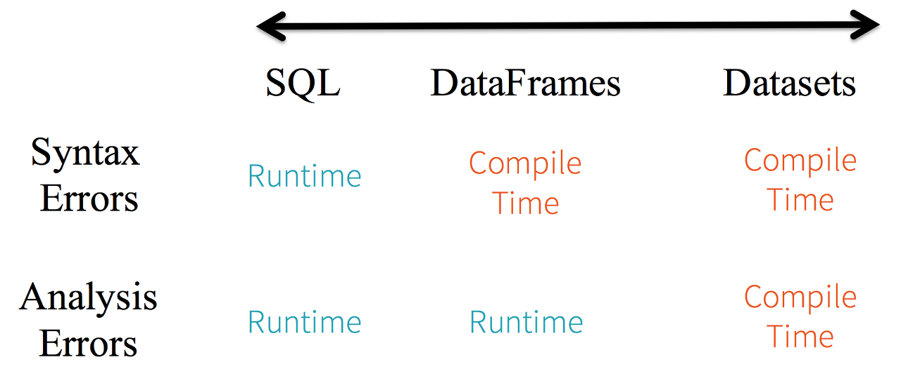

  


#### Dataset 생성

- ##### spark-shell에서 생성

  1. ###### 내부 데이터 이용

     ```
     val coffeeData = Seq(("Americano", 4300),
     ("CafeLatte", 5300),
     ("CafeMocha", 5800))
     
     val coffeeDS = coffeeData.toDS()
     
     coffeeDS.show()
     
     coffeeDS.select("_1").show()
     ```

     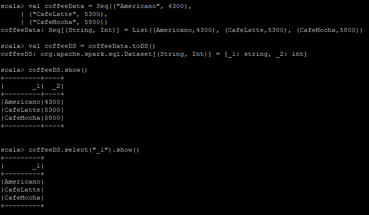

     

  2. ###### case class 이용

     case class를 이용하면 칼럼명을 이용하여 데이터 조회가 가능

     ```scala
     case class Coffee(menu: String, price: Int)
     
     val coffeeData = Seq(Coffee("Americano", 4300),
     Coffee("CafeLatte", 5300),
     Coffee("CafeMocha", 5800))
     
     val coffeeDS = coffeeData.toDS()
     
     coffeeDS.show()
     
     coffeeDS.select("price").show()
     ```

     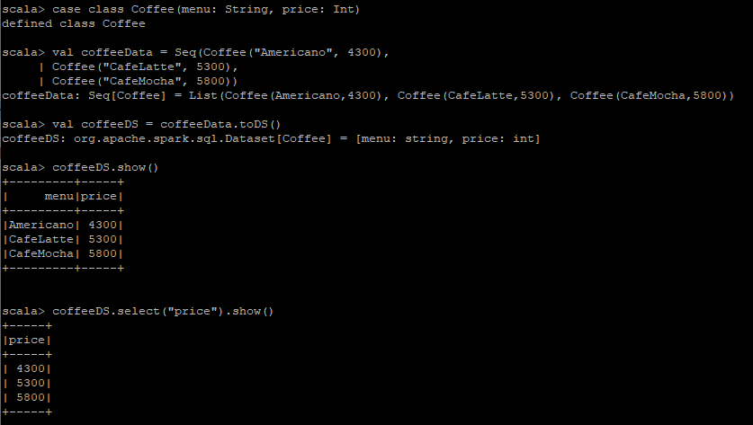

     

  3. RDD -> Dataset

     RDD를 Dataset으로 변환하기 위해서는 DataFrame으로 변경 후 Dataet으로 변경해야 함

     

     - RDD -> DataFrame

       ```scala
       import org.apache.spark.sql._
       import org.apache.spark.sql.types._
       
       var flightData = sc.textFile("/user/root/flightdata/*.csv")
       
       // CSV파일을 RDD로 Read시 Header만 Skip하는 방법은 따로 없음
       // Read 후 Header에 해당하는 부분을 제거해주는 작업이 필요함
       var flightRDD = flightData.mapPartitionsWithIndex {(idx, iter) => if (idx == 0) iter.drop (1) else iter}
       
       // DataFrame 생성시 사용할 Schema 선언
       val flightSchema = new StructType().
       add(StructField("DEST_COUNTRY_NAME",StringType,true)).
       add(StructField("ORIGIN_COUNTRY_NAME",StringType,true)).
       add(StructField("count",IntegerType,true))
       
       // Read한 내용을 CSV Delimiter인 ','으로 나눔
       val sepflightRDD = flightRDD.map(line => line.split(",")).map(x => Row(x(0),x(1),x(2).trim.toInt))
       
       // DataFrame 생성
       val flightDF = spark.createDataFrame(sepflightRDD, flightSchema)
       
       flightDF.show()
       ```

       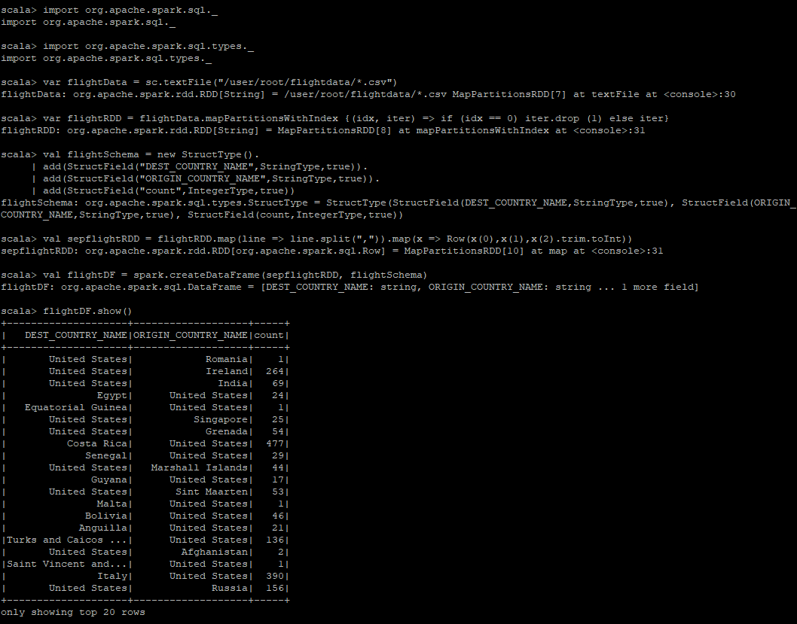

     

     - DataFrame -> Dataset

       ```scala
       case class Flight(DEST_COUNTRY_NAME: String, ORIGIN_COUNTRY_NAME: String, count: Int)
       
       val flightDS = flightDF.as[Flight]
       
       flightDS.show()
       ```

       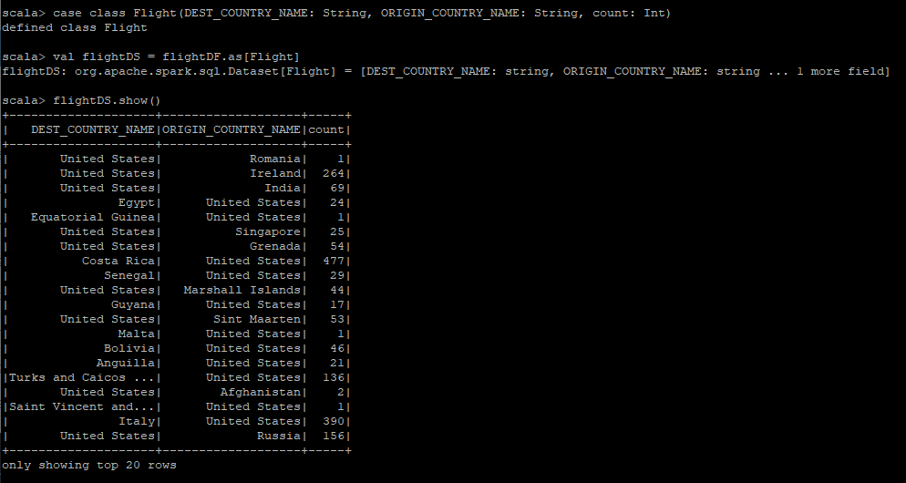

     

  4. DataFrame -> Dataset

     ```
     case class Flight(DEST_COUNTRY_NAME: String, ORIGIN_COUNTRY_NAME: String, count: Int)
     
     val flightDF = spark.read.option("inferSchema", true).option("header",true).csv("/user/root/flightdata/*.csv")
     
     val fligttDS = flightDF.as[Flight]
     
     flightDS.show()
     ```

     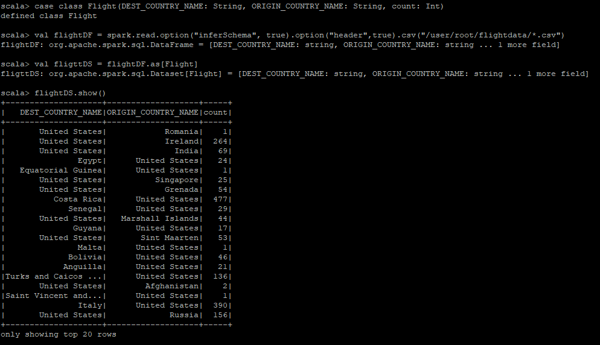


## Hadoop InputFormat 사용

Java에서 Custom InputFormat을 이용하여 CSV File을 RDD로 읽어오는 것을 목표로함

scala와는 메소드명 등 약간의 차이가 있으나 전체적인 흐름은 같음

- #### newAPIHadoopFile ( = HadoopFIle[옛버전] )

  Hadoop InputFormat을 이용하여 파일을 읽기 위해서는 반드시 `JavaSparkContext객체의 newAPIHadoopFile 메소드`를 사용해야 함

  또한 읽은 파일은 무조건 PairRDD<k,v>로 리턴됨

> ##### Hadoop InputFormat으로 CSV파일을 읽을 때 주의할 점
>
> CSV에는 Header가 포함되있으므로 Int형 데이터를 담은 칼럼이여도
>
> 첫 라인은 반드시 String이 오게 됨.
>
>  Type MissMatch 오류가 발생한다면 참고해볼 것


- #### InputFormat 작성

  읽어 올 파일(CSV)의 구조 파악

  ```
  DEST_COUNTRY_NAME,ORIGIN_COUNTRY_NAME,count
  United States,Romania,1
  United States,Ireland,264
  ```

  1. ##### FlightDataWritable

     ```java
     package input;
     import org.apache.hadoop.io.Text;
     import org.apache.hadoop.io.WritableComparable;
     import org.apache.hadoop.io.WritableUtils;
     
     import java.io.DataInput;
     import java.io.DataOutput;
     import java.io.IOException;
     
     public class FlightDataWritable implements WritableComparable<FlightDataWritable> {
         private String DEST_COUNTRY_NAME;
         private String ORIGIN_COUNTRY_NAME;
         private String count;
     
         public FlightDataWritable(Text text){
             String[] tokens = text.toString().split(",");
     
             DEST_COUNTRY_NAME = tokens[0];
             ORIGIN_COUNTRY_NAME = tokens[1];
             count = tokens[2];
         }
     
         public String getDEST_COUNTRY_NAME() {
             return DEST_COUNTRY_NAME;
         }
     
         public String getORIGIN_COUNTRY_NAME() {
             return ORIGIN_COUNTRY_NAME;
         }
     
         public String getCount() {
             return count;
         }
     
         @Override
         public int compareTo(FlightDataWritable o) {
             return 0;
         }
     
         @Override
         public void write(DataOutput out) throws IOException {
             WritableUtils.writeString(out, DEST_COUNTRY_NAME);
             WritableUtils.writeString(out, ORIGIN_COUNTRY_NAME);
             WritableUtils.writeString(out, count);
     
         }
     
         @Override
         public void readFields(DataInput in) throws IOException {
             DEST_COUNTRY_NAME = WritableUtils.readString(in);
             ORIGIN_COUNTRY_NAME = WritableUtils.readString(in);
             count = WritableUtils.readString(in);
         }
     }
     ```

     

  2. ##### FlightDataRecord (RecordReader 내용을 가져와 수정)

     ```java
     package input;
     
     import org.apache.hadoop.conf.Configuration;
     import org.apache.hadoop.fs.FSDataInputStream;
     import org.apache.hadoop.fs.FutureDataInputStreamBuilder;
     import org.apache.hadoop.fs.Path;
     import org.apache.hadoop.fs.Seekable;
     import org.apache.hadoop.fs.impl.FutureIOSupport;
     import org.apache.hadoop.io.LongWritable;
     import org.apache.hadoop.io.Text;
     import org.apache.hadoop.io.compress.*;
     import org.apache.hadoop.mapreduce.InputSplit;
     import org.apache.hadoop.mapreduce.MRJobConfig;
     import org.apache.hadoop.mapreduce.RecordReader;
     import org.apache.hadoop.mapreduce.TaskAttemptContext;
     import org.apache.hadoop.mapreduce.lib.input.*;
     import org.slf4j.Logger;
     import org.slf4j.LoggerFactory;
     
     import java.io.IOException;
     
     public class FlightDataRecord extends RecordReader<LongWritable, FlightDataWritable> {
     
         private static final Logger LOG = LoggerFactory.getLogger(LineRecordReader.class);
         public static final String MAX_LINE_LENGTH = "mapreduce.input.linerecordreader.line.maxlength";
     
         private long start;
         private long pos;
         private long end;
         private SplitLineReader in;
         private FSDataInputStream fileIn;
         private Seekable filePosition;
         private int maxLineLength;
         private LongWritable key;
         private Text value;
         private boolean isCompressedInput;
         private Decompressor decompressor;
         private byte[] recordDelimiterBytes;
     
         @Override
         public void initialize(InputSplit genericSplit, TaskAttemptContext context) throws IOException, InterruptedException {
             FileSplit split = (FileSplit) genericSplit;
             Configuration job = context.getConfiguration();
             this.maxLineLength = job.getInt(MAX_LINE_LENGTH, Integer.MAX_VALUE);
             start = split.getStart();
             end = start + split.getLength();
             final Path file = split.getPath();
     
             final FutureDataInputStreamBuilder builder =
                     file.getFileSystem(job).openFile(file);
             FutureIOSupport.propagateOptions(builder, job,
                     MRJobConfig.INPUT_FILE_OPTION_PREFIX,
                     MRJobConfig.INPUT_FILE_MANDATORY_PREFIX);
             fileIn = FutureIOSupport.awaitFuture(builder.build());
     
             CompressionCodec codec = new CompressionCodecFactory(job).getCodec(file);
             if (null!=codec) {
                 isCompressedInput = true;
                 decompressor = CodecPool.getDecompressor(codec);
                 if (codec instanceof SplittableCompressionCodec) {
                     final SplitCompressionInputStream cIn =
                             ((SplittableCompressionCodec)codec).createInputStream(
                                     fileIn, decompressor, start, end,
                                     SplittableCompressionCodec.READ_MODE.BYBLOCK);
                     in = new CompressedSplitLineReader(cIn, job,
                             this.recordDelimiterBytes);
                     start = cIn.getAdjustedStart();
                     end = cIn.getAdjustedEnd();
                     filePosition = cIn;
                 } else {
                     if (start != 0) {
                         throw new IOException("Cannot seek in " +
                                 codec.getClass().getSimpleName() + " compressed stream");
                     }
     
                     in = new SplitLineReader(codec.createInputStream(fileIn,
                             decompressor), job, this.recordDelimiterBytes);
                     filePosition = fileIn;
                 }
             } else {
                 fileIn.seek(start);
                 in = new UncompressedSplitLineReader(
                         fileIn, job, this.recordDelimiterBytes, split.getLength());
                 filePosition = fileIn;
             }
             if (start != 0) {
                 start += in.readLine(new Text(), 0, maxBytesToConsume(start));
             }
             this.pos = start;
         }
     
         private int maxBytesToConsume(long pos) {
             return isCompressedInput
                     ? Integer.MAX_VALUE
                     : (int) Math.max(Math.min(Integer.MAX_VALUE, end - pos), maxLineLength);
         }
     
         private long getFilePosition() throws IOException {
             return isCompressedInput && null != filePosition ? filePosition.getPos() : pos;
         }
     
         private int skipUtfByteOrderMark() throws IOException {
     
             int newMaxLineLength = (int) Math.min(3L + (long) maxLineLength,
                     Integer.MAX_VALUE);
             int newSize = in.readLine(value, newMaxLineLength, maxBytesToConsume(pos));
             pos += newSize;
             int textLength = value.getLength();
             byte[] textBytes = value.getBytes();
             if ((textLength >= 3) && (textBytes[0] == (byte)0xEF) &&
                     (textBytes[1] == (byte)0xBB) && (textBytes[2] == (byte)0xBF)) {
                 // find UTF-8 BOM, strip it.
                 LOG.info("Found UTF-8 BOM and skipped it");
                 textLength -= 3;
                 newSize -= 3;
                 if (textLength > 0) {
                     // It may work to use the same buffer and not do the copyBytes
                     textBytes = value.copyBytes();
                     value.set(textBytes, 3, textLength);
                 } else {
                     value.clear();
                 }
             }
             return newSize;
         }
     
         @Override
         public boolean nextKeyValue() throws IOException {
             if (key == null) {
                 key = new LongWritable();
             }
             key.set(pos);
             if (value == null) {
                 value = new Text();
             }
             int newSize = 0;
             // We always read one extra line, which lies outside the upper
             // split limit i.e. (end - 1)
             while (getFilePosition() <= end || in.needAdditionalRecordAfterSplit()) {
                 if (pos == 0) {
                     newSize = skipUtfByteOrderMark();
                 } else {
                     newSize = in.readLine(value, maxLineLength, maxBytesToConsume(pos));
                     pos += newSize;
                 }
     
                 if ((newSize == 0) || (newSize < maxLineLength)) {
                     break;
                 }
     
                 // line too long. try again
                 LOG.info("Skipped line of size " + newSize + " at pos " +
                         (pos - newSize));
             }
             if (newSize == 0) {
                 key = null;
                 value = null;
                 return false;
             } else {
                 return true;
             }
         }
     
         @Override
         public LongWritable getCurrentKey() {
             return key;
         }
     
         @Override
         public FlightDataWritable getCurrentValue() {
             return new FlightDataWritable(value);
         }
     
         /**
          * Get the progress within the split
          */
         @Override
         public float getProgress() throws IOException {
             if (start == end) {
                 return 0.0f;
             } else {
                 return Math.min(1.0f, (getFilePosition() - start) / (float)(end - start));
             }
         }
     
         @Override
         public synchronized void close() throws IOException {
             try {
                 if (in != null) {
                     in.close();
                 }
             } finally {
                 if (decompressor != null) {
                     CodecPool.returnDecompressor(decompressor);
                     decompressor = null;
                 }
             }
         }
     }
     ```

     

  3. ##### FlightDataInputFormat

     ```java
     package input;
     
     import org.apache.hadoop.io.LongWritable;
     import org.apache.hadoop.mapreduce.InputSplit;
     import org.apache.hadoop.mapreduce.RecordReader;
     import org.apache.hadoop.mapreduce.TaskAttemptContext;
     import org.apache.hadoop.mapreduce.lib.input.FileInputFormat;
     
     import java.io.IOException;
     
     public class FlightDataInputFormat extends FileInputFormat<LongWritable, FlightDataWritable> {
     
         @Override
         public RecordReader<LongWritable, FlightDataWritable> createRecordReader(InputSplit split, TaskAttemptContext context) throws IOException, InterruptedException {
             return new FlightDataRecord();
         }
     }
     ```

  

- #### 실행파일 작성 및 실행

  1. ##### ReadByIF ( 실행파일:main() )

     ```java
     import input.FlightDataInputFormat;
     import input.FlightDataWritable;
     import org.apache.hadoop.conf.Configuration;
     import org.apache.hadoop.io.LongWritable;
     import org.apache.spark.SparkConf;
     import org.apache.spark.api.java.JavaPairRDD;
     import org.apache.spark.api.java.JavaRDD;
     import org.apache.spark.api.java.JavaSparkContext;
     import org.apache.spark.sql.Dataset;
     import org.apache.spark.sql.Row;
     import org.apache.spark.sql.SQLContext;
     import org.apache.spark.sql.types.DataTypes;
     import org.apache.spark.sql.types.StructType;
     import scala.Tuple2;
     import org.apache.spark.sql.SparkSession;
     import org.apache.spark.sql.SQLContext;
     
     
     public class ReadByIF {
         public static void main(String[] args) throws Exception {
     
             if (args.length < 1) {
                 System.err.println("Usage : ReadByIF <input file path>");
                 System.exit(1);
             }
     
             SparkConf sparkconf = new SparkConf().setMaster("yarn").setAppName("InputFormat");
     
             CSVtoDataFrame(sparkconf, args);
         }
     
         public static void CSVtoDataFrame(SparkConf sparkconf, String[] args) throws Exception {
             JavaSparkContext sc = new JavaSparkContext(sparkconf);
     
             Configuration conf = new Configuration();
             
             JavaPairRDD<LongWritable, FlightDataWritable> lines = sc.newAPIHadoopFile(args[0], FlightDataInputFormat.class, LongWritable.class, FlightDataWritable.class, conf);
     
             JavaRDD<FlightDataWritable> fulldata = lines.map(v1 -> v1._2);
     
             for (Tuple2<LongWritable, FlightDataWritable> line : lines.take(10)) {
                 FlightDataWritable fdw = line._2;
                 System.out.println(fdw.getORIGIN_COUNTRY_NAME() + " >> " + fdw.getDEST_COUNTRY_NAME() + " :: " + fdw.getCount());
             }
         }
     }
     ```
     
     
     
  2. ##### 실행
  
     ```bash
     spark-submit --class ReadByIF sbj.jar /user/root/flightdata/*
     ```
  
     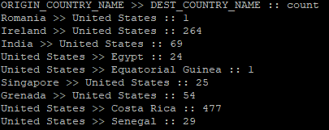
     
     


#### To do..

~~읽은 RDD를 DataFrame으로 변환해하는 것도 시도중이나 잘 되지않고 있음~~

~~( Custom inputformat과 Schema간에 타입을 맞춰주기가 쉽지않음..)~~

해결하였으며 아래의 내용대로 진행해볼 것


Q1. RDD 객체 생성 단계부터 1번째 Row을 제외하고 읽는 방법이 있을까?

A1. RDD 정보를 가져올 방법은 collect(), take() 두 가지밖에 없음, 또한 take()는 무조건 처음부터 읽어오도록 설계되어있으므로 읽는 단계에서 Header를 제외하고 읽기는 힘들어보임

​	>> 읽은 뒤 헤더 부분만 제거하는 방법으로 해결


Q2. InputFormatWritable 객체와 Schema를 어떻게 매칭시켜주지?

A2. PairRDD -> RDD<Row> 매핑시 Schema에 해당되는 Row객체를 리턴해주면 됨

​		자세한 내용은 아래의 코드 참조

```java
public static void CSVtoDataFrame(SparkConf sparkconf, String[] args) throws Exception {
        JavaSparkContext sc = new JavaSparkContext(sparkconf);

        Configuration conf = new Configuration();

        JavaPairRDD<LongWritable, FlightDataWritable> lines = sc.newAPIHadoopFile(args[0], FlightDataInputFormat.class, LongWritable.class, FlightDataWritable.class, conf);
    
    	// JavaRDD 객체 생성
        JavaRDD<Row> fulldata = lines.map(v1 -> {
            FlightDataWritable flightDataWritable = v1._2;
            String count = flightDataWritable.getCount();
            String dest_country_name = flightDataWritable.getDEST_COUNTRY_NAME();
            String origin_country_name = flightDataWritable.getORIGIN_COUNTRY_NAME();
            return new GenericRow(new Object[]{dest_country_name, origin_country_name, count});
        });

        // 헤더 정보 제거
        Row header = fulldata.first();

        /**
         * Scala Code : var onlydata = fulldata.filter(v1 => v1 != header)
         * Java는 !=로 값을 비교할 수 없으므로 equals()를 사용하여
         * 아래와 같이 사용하며 주석의 내용과 같은 의미임
         */

        JavaRDD<Row> onlydata = fulldata.filter(v1 -> {
            return !v1.equals(header);
                });

//        JavaRDD<Row> onlydata = fulldata.filter(v1 -> {
//            if (v1.equals(header)) {
//                return false;
//            }else{
//                return true;
//            }
//        });

        StructField field1 = DataTypes.createStructField("DEST_COUNTRY_NAME", DataTypes.StringType, true);
        StructField field2 = DataTypes.createStructField("ORIGIN_COUNTRY_NAME", DataTypes.StringType, true);
        StructField field3 = DataTypes.createStructField("Count", DataTypes.StringType, true);

        /**
         * Schema 생성방법 1
         */
//        StructType schema = new StructType();
//
//        schema.add(field1);
//        schema.add(field2);
//        schema.add(field3);

        /**
         * Schema 생성방법 2
         */
        StructType schema = new StructType(
                new StructField[]{
                        field1,
                        field2,
                        field3
                }
        );

        /**
         * Schema 생성방법 3
         * Schema 내용들을 담은 Class를 만들어 아래와 같이 DF 생성가능
         */

//        Dataset<Row> df = spark.createDataFrame(fulldata, Schema.class);

    
		// SQLContext 객체 생성 후 DF 생성
        SQLContext spark = new SQLContext(sc);

        Dataset<Row> df = spark.createDataFrame(onlydata, schema);

        df.show();
        
//        for (Tuple2<LongWritable, FlightDataWritable> line : lines.take(10)) {
//            FlightDataWritable fdw = line._2;
//            System.out.println(fdw.getORIGIN_COUNTRY_NAME() + " >> " + fdw.getDEST_COUNTRY_NAME() + " :: " + fdw.getCount());
//        }

    }
```


## Spark SQL 사용

SQL을 이용하여 RDD, DataSet, DataFrame 작업을 생성하고 처리

- CLI

  - DataFrame 생성

    ```
    var FlightDF = spark.read.option("inferSchema",true).option("header",true).csv("/user/root/flightdata/*.csv")
    ```

    

  - Show()

    DataFrame을 유저가 보기 좋은 view로 출력해줌

    ```scala
    // Default 최대 20개까지 보여줌
    FlightDF.show()
    // 직접 지정하면 20개 이하, 이상까지 볼 수 있음
    FlightDF.show(5)
    ```

    

  - printSchema()

    DataFrame의 칼럼명과 데이터 타입을 출력해줌

    ```
    FlightDF.printSchema()
    ```

    

  - filter()
    SQL의 where절과 같은 역할

    

    

    

    

    ```
    
    ```

    

  - where()

  - count()

  - collect()

  - group by()

  - join()

  - 

- API


- UDF 만들어서 실행

  UDF : 사용자정의함수

  

 

## Json 파일 사용

- org.apache.spark.sql.execution.datasources.json.JsonFileFormat

## Parquet 파일 사용

- org.apache.spark.sql.execution.datasources.parquet.ParquetFileFormat

## Orc 파일 사용

- org.apache.spark.sql.execution.datasources.orc.OrcFileFormat